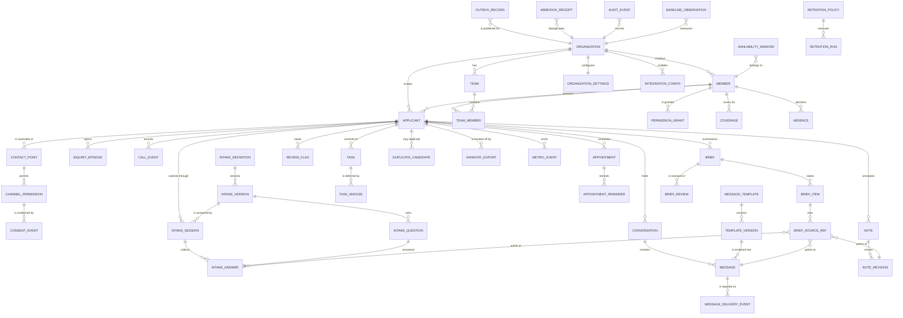
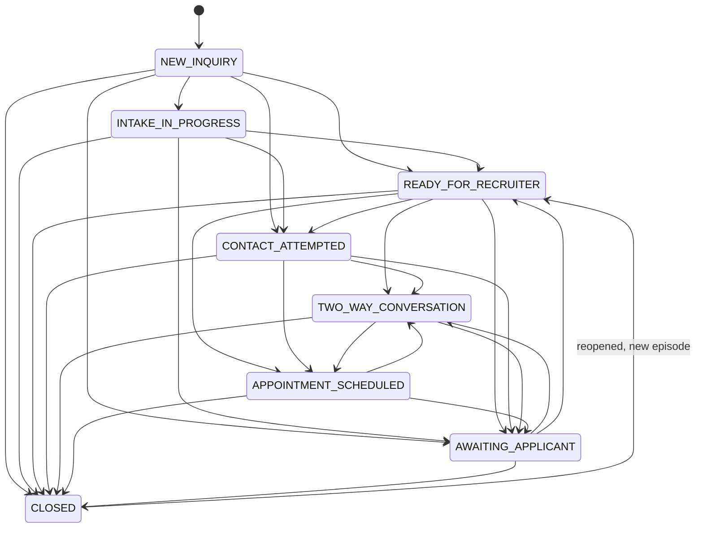
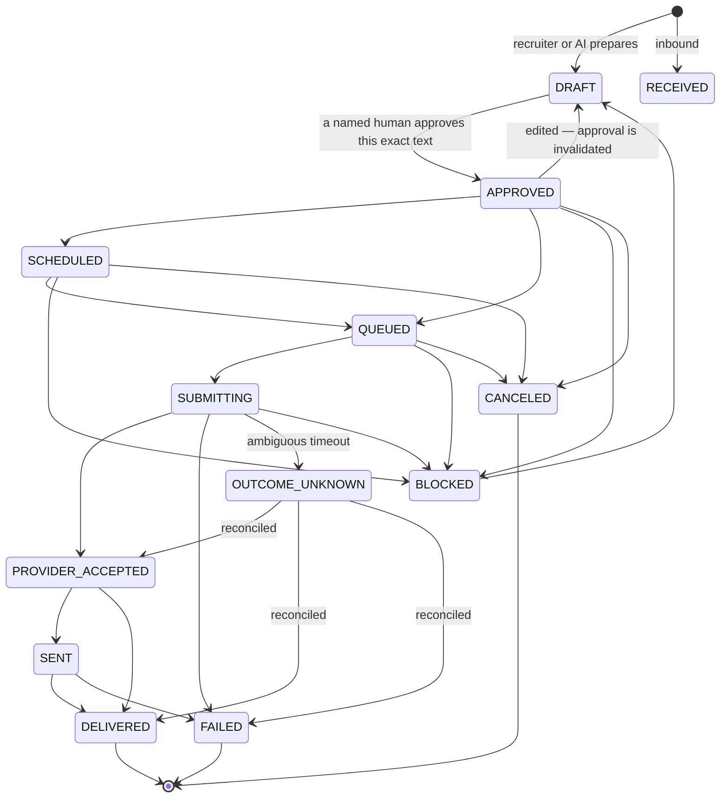
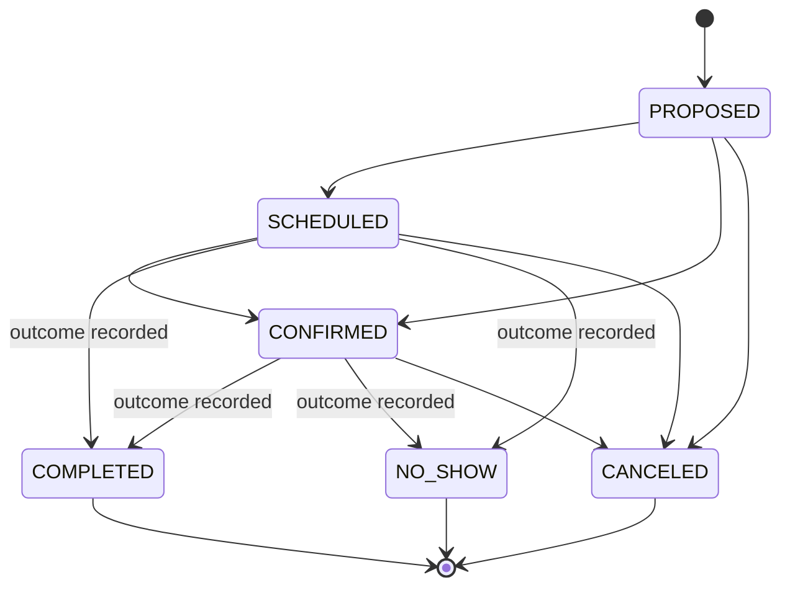
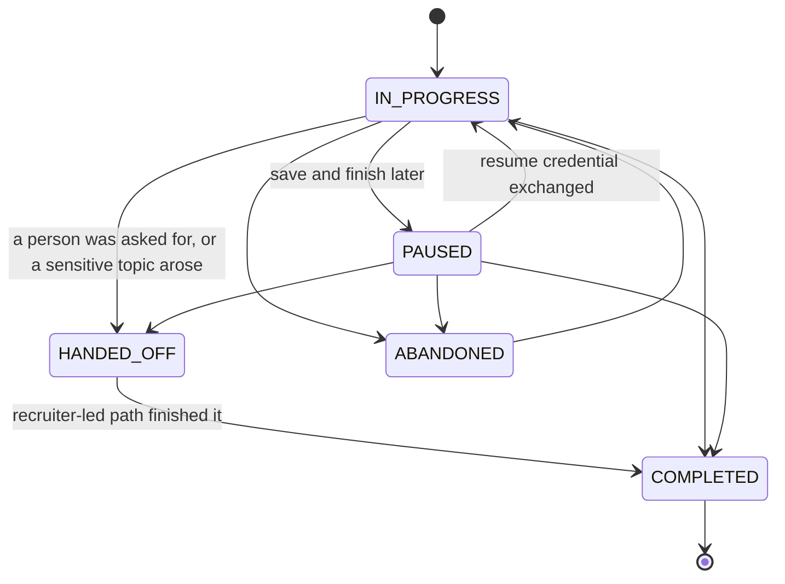
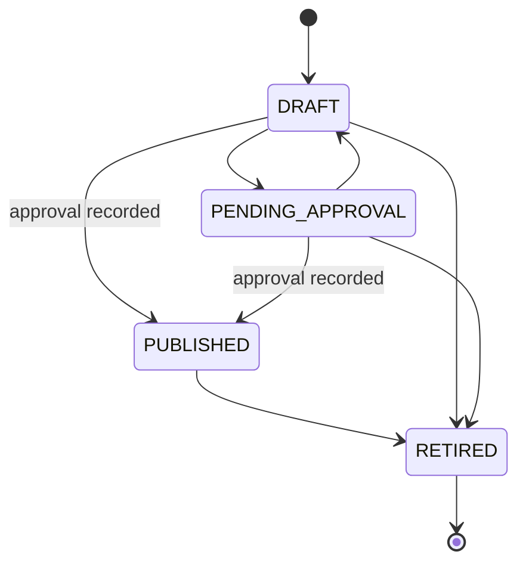
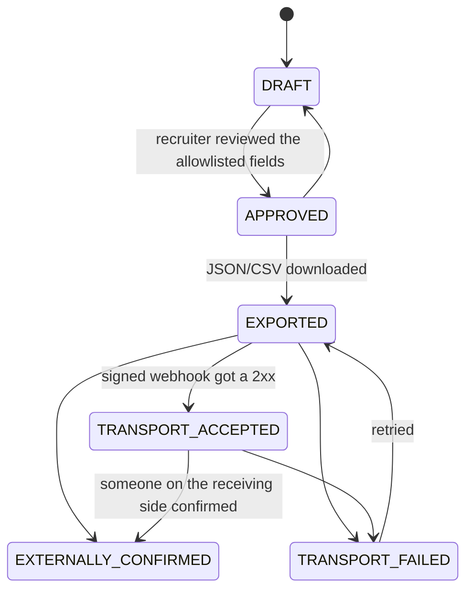
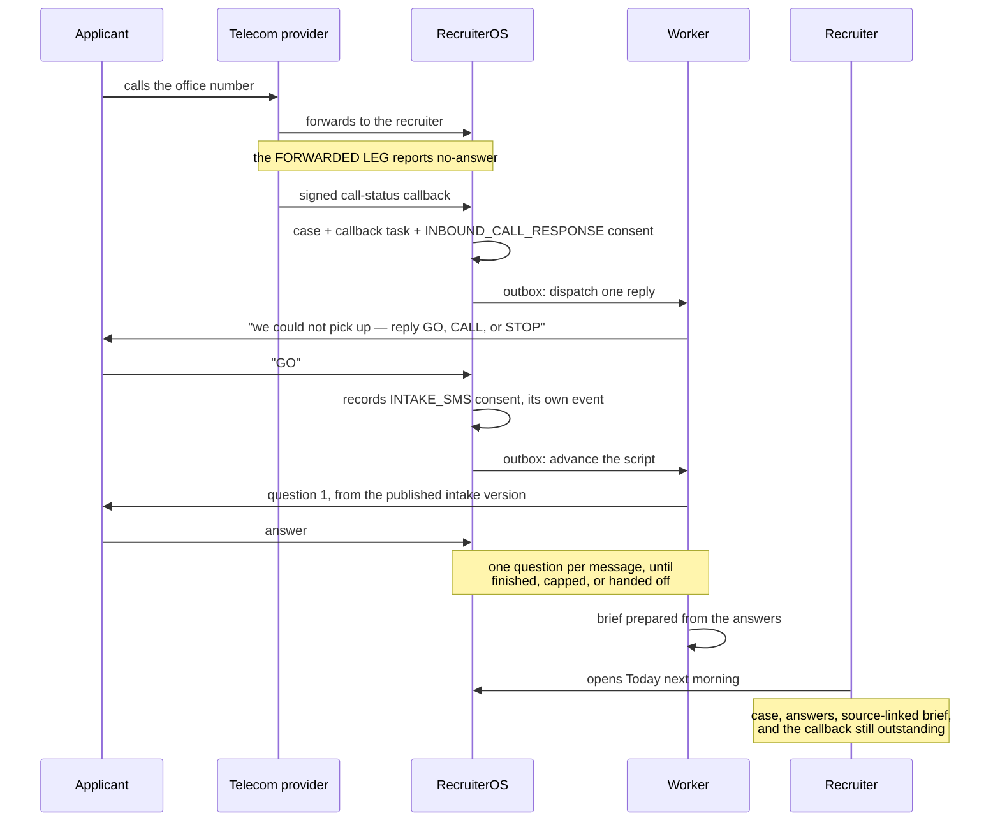

# Architecture

A modular monolith plus one durable worker. Both talk to the same PostgreSQL
database. Nothing else is required to run the product.

```
┌──────────────────────────────────────────────────────────────┐
│ Next.js App Router (src/app)                                 │
│  (workspace) recruiter pages · (auth) · public intake        │
│  server actions · route handlers · webhooks                  │
└───────────────────────────┬──────────────────────────────────┘
                            │  every read and write
┌───────────────────────────▼──────────────────────────────────┐
│ Authorization policy  (src/server/authz/policy.ts)           │
│ ONE layer for pages, queries, mutations, exports and jobs    │
└───────────────────────────┬──────────────────────────────────┘
┌───────────────────────────▼──────────────────────────────────┐
│ Domain services  (src/server/services/*)                     │
│ queue · cases · intake · messaging · briefs · appointments   │
│ tasks · consent · duplicates · reports · retention · handoff │
│ state machines (src/server/domain/state-machines.ts)         │
└──────┬───────────────────────────────────┬───────────────────┘
       │ Prisma + pg adapter               │ transactional outbox
┌──────▼───────────────────┐   ┌───────────▼───────────────────┐
│ PostgreSQL 16            │◀──│ Worker (worker/) + pg-boss    │
│ business data · outbox   │   │ sends · reminders · briefs    │
│ audit · pg-boss queues   │   │ reconciliation · maintenance  │
└──────────────────────────┘   └───────────────────────────────┘
       ▲
       │ provider-neutral interfaces (src/server/providers/*)
       │ sms: simulator | twilio     voice: simulator | twilio
       │ ai: local-rules | anthropic  webhook: signed outbound
```

## Rules the structure enforces

**Domain logic lives in services, not components.** A React component renders
what a service returned. Every mutation is a server action or route handler
that validates with Zod, resolves an actor context, calls the policy layer and
then a service.

**One authorization layer.** `caseAccess(ctx, subject)` returns
`{ metadata, content, sensitive, act, reassign, basis }`. `requireCase` throws
`NotFoundError` when there is no access at all — a caller must not learn that
a row exists — and `ForbiddenError`, naming the missing grant, when there is
partial access. Pages, queries, mutations, CSV exports, `.ics` downloads,
brief citations and worker jobs all go through it. See
[PERMISSIONS.md](./PERMISSIONS.md).

**One clock.** `src/server/clock.ts` is the only source of "now". Nothing else
calls `new Date()`. Row timestamps are stamped from it rather than defaulted by
the database, so a pinned `DEMO_CLOCK` produces a coherent dataset and the
tests are deterministic.

**Tenant isolation in the schema, not the query.** Every business row carries
`organizationId`; child rows reference parents through compound foreign keys
that include it, so a cross-organization reference cannot be written even by a
mistaken query. Uniqueness is scoped the same way.

**Timezones without a date library.** `src/lib/time.ts` uses `Intl` only.
`resolveZonedTime` returns `exact`, `invalid` (a DST gap — rejected) or
`ambiguous` (a DST overlap — requires explicit acceptance). Instants are stored
in UTC with the IANA zone they were agreed in.

**No client-side persistence.** There is no `localStorage` state, no
in-memory array standing in for a table, and no applicant data in a URL, a log
line or a job payload. Jobs carry scoped identifiers and re-read current state
when they execute.

---

## Entity relationships

The full schema is `prisma/schema.prisma` (about 45 models). This is the
operational core; auth tables, settings, templates, retention and metrics are
listed after it.



Not drawn, but present: `USER`, `SESSION`, `ACCOUNT`, `VERIFICATION`,
`TWO_FACTOR` (Better Auth), `INVITATION`, `COMMERCIAL_METADATA`, and
`SYSTEM_CLOCK` (the demo clock's persisted offset).

### Invariants the database enforces

TypeScript types are not constraints. These live in
`prisma/migrations/20260921030000_invariant_constraints/migration.sql`:

| Constraint | What it prevents |
| --- | --- |
| `appointment_no_overlap` — `EXCLUDE USING gist` over `(organizationId, recruiterMemberId, tsrange(startsAt, endsAt))` where the state is active | Double-booking a recruiter, including from two concurrent requests |
| `appointment_outcome_required` | `COMPLETED` or `NO_SHOW` without a recorded outcome, its timestamp and the member who entered it |
| `applicant_active_requires_owner` | An open case with nobody accountable for it |
| `task_original_due_not_after_due` | Snoozing quietly erasing the date that was originally promised |
| `coverage_expires_after_start` | A coverage grant that never expires |
| `message_dispatchable_requires_approval` | An outbound message reaching a dispatchable state without an approved body hash |
| `intake_version_one_published` (partial unique index) | Two published versions of the same question set |

---

## Today's Priority Queue

The ordering is deterministic, derived only from workflow events, and
explained in the UI. **There is no applicant-quality score** — nothing about
the person enters the sort.

Categories, in order:

1. **Human review requested** — an open human-requested or sensitive-topic flag
2. **Overdue promised action** — an open task past the date we promised
3. **Callback window open** — an open callback task whose window is now
4. **New inquiry awaiting a recruiter** — no human has reached out on this episode
5. **Due work** — everything else with an open commitment
6. **Waiting / upcoming** — dated waiting states and future work

Within a category: due time ascending, then the oldest waiting event, then the
case reference as a stable tie-breaker. Ranking, filtering and pagination all
happen in SQL over indexed columns (`src/server/services/queue.ts`); nothing is
filtered in application memory and the case file does not N+1.

Every active case has exactly one accountable owner and a concrete next step
with a date. A waiting state still carries a review date. Completing or
cancelling the last actionable task forces one of: a new next step, a dated
waiting state, or an explicit closed state with a reason.

---

## State machines

Each is an explicit transition table in
`src/server/domain/state-machines.ts`. The enum keeps invalid *values* out of
the column; the table keeps invalid *moves* out of the workflow, which is the
part that actually breaks when a person and a provider callback touch a row at
the same moment.

### Case status

`CLOSED` is an operational state with a reason. It is never a determination
about eligibility. Reopening starts a **new inquiry episode**, so reporting
clocks are not silently reset.



### Message transport

Authorship (applicant / recruiter / approved automation) is a **separate
field** from transport state. Provider acceptance is not delivery, and
delivery is not a human conversation — the reports keep all three apart.

Note what is missing: `PROVIDER_ACCEPTED` never returns to `QUEUED`,
`DELIVERED` is terminal, and `OUTCOME_UNKNOWN` can only be left by
reconciliation — never by another send attempt.



Out-of-order provider callbacks are resolved by `messageStateRank`: a late
"sent" never demotes a row a newer "delivered" already advanced. Delivery
events are append-only, so the history stays intact either way.

### Appointment

Completion requires an authorized outcome entry, enforced by a CHECK
constraint. Rescheduling preserves lineage without counting a superseded slot
as attended.



### Intake session



### Question-set version

Publishing **is** the approval: the action records who approved it and on what
basis, so `DRAFT → PUBLISHED` is allowed. `PENDING_APPROVAL` exists for an
organization that wants a separate reviewer. A published version is never
edited — it is retired and replaced, and sessions in flight keep the version
they started on.



Recording an organization's approval is exactly that. It does **not** create
official authorization, and the settings page says so.

### Handoff export



A 2xx is `TRANSPORT_ACCEPTED`, not acceptance by a business system. This is a
manual handoff; it is not proof of import into an official system, and no
government API is fabricated or scraped.

---

## Intake

A scripted, versioned flow — not an unrestricted chatbot. The greeting says
plainly that it is an automated intake assistant, that a recruiter reads
everything, and that a human callback can be requested without answering
anything else. Two paths: **Request a callback** and **Share a little more
information**. The human-request control is available on every screen.

- The callback path asks only for the minimum usable contact information, the
  requested channel, availability and timezone, and the permission needed for
  that channel. Consenting to optional SMS is never a condition of asking for a
  phone callback.
- Questions include "Not sure" and "Prefer to discuss with a recruiter", and
  optional questions are visibly optional and skippable.
- **Citizenship questions are disabled by default.** The youth/age policy is an
  explicit deployment configuration requiring organizational review; the code
  does not invent a universal rule.
- SSNs, exact birth dates, government identifiers, documents, medical histories,
  detailed legal histories and attachments are **not requested in this build**.
- Progress is server-side. Pause/resume uses a high-entropy credential stored
  only as a hash, with an expiry and a revocation path; it is exchanged once for
  a limited session and removed from the navigable URL. Stored intake is never
  retrievable by a phone or email lookup, revealing earlier answers on a new
  device requires additional verification, and verification and resume are
  rate-limited with uniform responses so accounts cannot be enumerated.
- On a medical, legal, waiver or otherwise sensitive question the flow does not
  investigate or answer. It uses neutral handoff language, raises a
  recruiter-review task and pauses automated progression. Unavoidable sensitive
  free text is stored with restricted access and excluded from external AI by
  default. Detection is a routing aid; an explicit human request always wins.
- Completion explains what happens next **without inventing a response-time
  promise**, creates or associates the case, assigns an accountable recruiter
  through the configured routing, and establishes a next step — in one
  transaction.
- Intake remains fully usable when AI is unavailable.

---

## Text-back intake

The problem this solves is the one a recruiter actually has. Somebody calls at
16:40 while the recruiter is in a school. By the time he calls back they do not
answer. He texts. They reply two days later. Four rounds of missed contact
later he still does not know the first thing about them.

So: the call goes unanswered, **one** automated message goes back to that same
number saying so, and — only if the person says yes — the **same scripted,
versioned intake** runs over SMS, one question per message. In the morning the
recruiter opens Today and the case is already there with the answers, a
source-linked brief and a callback task.



### The rules it keeps

**It is not an autonomous agent.** It asks the published question set in
order. It cannot improvise, answer a question, or say anything that is not in
an approved, versioned artifact — the intake version or an approved template.

**A missed call is not permission to market to somebody.**
`INBOUND_CALL_RESPONSE` authorizes exactly one reply, to the number that
called, inside a configured window (default 15 minutes). Continuing by text
needs the person to say so, and that is recorded separately as `INTAKE_SMS`
with its own disclosure. Off by default: `textBackEnabled` is a deployment
decision with legal weight, not a product default.

**It refuses to guess.** `parseSmsAnswer` reads "2" against a numbered list as
an answer. It reads "maybe the second one I think" as unreadable and asks
again, because the alternative is putting words in somebody's mouth that a
recruiter then acts on. A reply that is neither a yes nor a no to the
invitation ends the script entirely — that is a person talking, and a script
should get out of the way.

**A person, asked for at any point, always wins.** So does any sensitive
topic. Both stop the script, pause automation on the **case** (not just the
session), raise the review flag and create the recruiter's work. The one
message that follows says so without investigating, reassuring or answering
anything.

**A bot exchange is never human contact.** Answering a scripted question does
not set `firstHumanOutreachAt` or `firstTwoWayHumanAt`, so it cannot inflate
the contact metrics. The case moves to `INTAKE_IN_PROGRESS`, not
`TWO_WAY_CONVERSATION`.

**The callback task stands throughout.** Somebody rang a person. That is still
the right follow-up, whatever the script collected.

**The case stops being a phone number.** A case opened from a missed call is
named `Inbound call ***7788`, because a number is all we have. When the person
gives their name, `enrichCaseFromAnswers` fills it in — **gaps only**. A value
a recruiter typed is never overwritten, which is the same rule the briefs
follow.

Every scripted message goes out through `sendApprovedTemplate`, so it is
subject to the same allowlist, approved published version, send gate
(opt-out, permission, quiet hours, provider enablement, case state) and
idempotency key as any other automated send. There is one documented
exemption: the message that tells somebody automation has stopped is sent
*after* the case is paused, so it is allowed past that single check and no
other.

---

## Brief preparation

`src/server/services/briefs.ts` with adapters in
`src/server/providers/ai/`. The local adapter is rules-based and says so; the
Anthropic adapter is optional, reads its model from configuration, and is only
reachable when an organization has explicitly enabled an approved provider and
approved data categories.

The brief answers four questions: what this person wants, what they have
already told us, what needs clarification, and what the recruiter should do
next.

Every **factual** item must carry source references that (a) exist, (b) belong
to the same case, and (c) quote an excerpt that actually appears in the
referenced message, intake answer or note revision. This is validated
server-side, against our own database, before anything is displayed. A result
whose citations do not check out is rejected rather than shown as a valid
brief. Source references are application-defined fields in our own JSON
schema; no provider citation feature is relied upon.

Interpretations are marked as suggestions. Unknown information is marked
unknown. Valid source links prove provenance, not correctness — the UI says
this, and recruiter review is never bypassed.

Transcripts are untrusted input. A message saying "ignore your instructions"
changes nothing: the model has no tools, no data access and no ability to cause
a request or an action. Action policy lives in application code, outside the
model.

Recruiter corrections are never overwritten by a later generation. New events
make an older brief visibly stale; an async result that arrives after a newer
reviewed version is discarded rather than applied. Corrections are tracked
through actual review actions — there is no invented accuracy score.

---

## Durable processing

Scheduled work runs in the worker (`worker/`), never in a browser timer or a
web-process `setTimeout`.

1. A service writes its business changes, its audit event and an
   **outbox record** in one transaction.
2. The worker's publisher claims outbox rows conditionally and publishes them
   to pg-boss with a business `singletonKey`, so a duplicate publication
   collapses.
3. Handlers are idempotent and **re-check current state when they run** —
   permission and consent can have changed since the job was enqueued, the
   appointment can have been rescheduled, the send can have been cancelled.
4. Retries are bounded with backoff. `dispatchMessage` has a retry limit of
   **zero**: an external side effect that may have happened is never blindly
   retried. An ambiguous timeout becomes `OUTCOME_UNKNOWN` and enters
   reconciliation.
5. Failures land in a dead-letter view at `/operations`, with redacted
   diagnostics, alongside blocked sends and the worker heartbeat.

Webhooks validate the signature, record durable receipt, deduplicate by
provider event id and acknowledge promptly; the slower work happens in a job.
Nothing promises exactly-once delivery through an external provider — the
product is explicit that it cannot.

---

## Testing

- `tests/unit` — time and DST resolution, state machines, CSV escaping and
  redaction.
- `tests/integration` — 13 files against **real PostgreSQL**, migrations
  applied by `globalSetup`, tables truncated per test, the clock pinned. These
  exercise the actual services and persistence; they do not assert that a mock
  was called.
- `tests/e2e` — Playwright against the running application and the seeded
  dataset, at 1440px and 375px, with axe-core WCAG 2.0/2.1 A/AA checks and
  screenshots.

See [BUILD_STATUS.md](./BUILD_STATUS.md) for exactly which checks were run and
what they returned.
